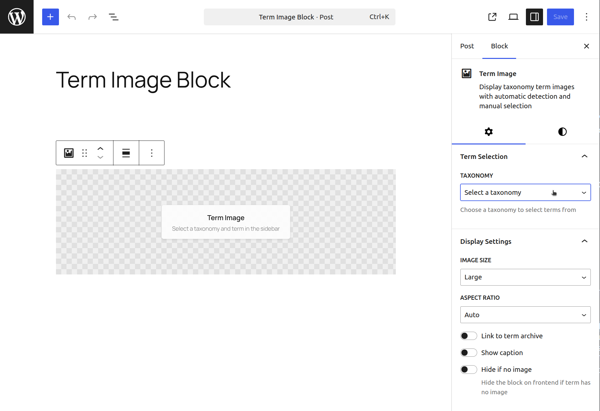

# Term Image Block

Display taxonomy term images with automatic detection and manual selection.

**Contributors:** carstenbach  
**Tags:** block, taxonomy, term, image, category  
**Requires PHP:** 7.4  
**Tested up to:** 6.8  
**Stable tag:** 0.1.0  
**License:** GPLv2 or later  
**License URI:** https://www.gnu.org/licenses/gpl-2.0.html  

## Description

[](https://playground.wordpress.net/?blueprint-url=https://raw.githubusercontent.com/carstingaxion/term-image-block/main/.wordpress-org/blueprints/blueprint.json) [](https://github.com/carstingaxion/term-image-block/actions/workflows/build-test-measure.yml)

The Term Image block allows you to elegantly showcase taxonomy term images throughout your WordPress site. Perfect for category pages, tag archives, and custom taxonomy displays, with full support for FSE templates.



### Key Features

- **Automatic Term Detection** — On archive pages, the block automatically displays the current term's image
- **FSE Template Support** — Works seamlessly in Full Site Editing templates for taxonomy archives
- **Manual Term Selection** — Choose any term from any taxonomy to display its image in posts or pages
- **Flexible Display Options** — Control image size, alignment, and aspect ratio
- **Term Image Management** — Upload, edit, and delete term images directly from the block editor
- **Placeholder State** — Shows helpful placeholders when no image is set
- **Responsive Design** — Images look great on all devices
- **Link Options** — Optionally link images to their term archive pages
- **Caption Support** — Add custom captions or use term names
- **Inherits core/image Block Styles** — Automatically picks up styles registered for `core/image` (e.g. Rounded)

### Perfect For

- Category archive headers in FSE templates
- Tag collection pages
- Custom taxonomy displays
- Product category showcases
- Blog section headers
- Any page where you want to display term images

## How It Works

1. **In FSE Templates:** Add the block to your taxonomy template. It will automatically detect and display the current term's image when viewing any archive page.
2. **In Posts/Pages:** Add the block anywhere and manually select a taxonomy and term to display its image.
3. **Image Management:** When a term is selected, you can upload, replace, or remove its image directly from the block settings. The image is saved to the term's meta data and can be used throughout your site.

## Compatibility with WP Term Images

This block stores images in the `image` term meta field — the same key used by [WP Term Images](https://wordpress.org/plugins/wp-term-images/) by JJJ (John James Jacoby). This means:

- Term images set via WP Term Images will automatically display in this block
- Images uploaded through this block will appear in the WP Term Images admin columns
- You can safely use both plugins together or migrate from one to the other without any data changes

## Installation

1. Upload the plugin files to `/wp-content/plugins/term-image-block`, or install through the WordPress plugins screen
2. Activate the plugin through the **Plugins** screen
3. Add the **Term Image** block to any post, page, or FSE template
4. Configure display options in the block settings panel

### For FSE Templates

1. Go to **Appearance > Editor**
2. Select a taxonomy template (e.g. Category Archive, Tag Archive)
3. Add the **Term Image** block
4. The block will automatically show the current term's image on the frontend

## Usage Examples

<details>
<summary><strong>Auto-detect on a taxonomy archive template</strong></summary>

Add the block to a taxonomy archive template with no attributes set. It will resolve the queried term automatically:

1. Go to **Appearance > Editor > Templates**
2. Open **Category Archives** (or any taxonomy template)
3. Insert the **Term Image** block
4. Leave the taxonomy selector on "Auto-detect"
5. The block shows a placeholder in the editor, and resolves the current term's image on the frontend

</details>

<details>
<summary><strong>Lock to a specific taxonomy in an FSE template</strong></summary>

If your template handles multiple taxonomies but you only want images from one:

1. Add the block to your template
2. In the **Term Detection** sidebar panel, select a specific taxonomy (e.g. "Categories")
3. On taxonomy archive pages, the block uses the queried term from that taxonomy
4. On single posts, it picks up the first term assigned to the post from that taxonomy

</details>

<details>
<summary><strong>Manual term selection in a post or page</strong></summary>

Display a specific term image anywhere on your site:

1. Add the block to a post or page
2. In the **Term Selection** sidebar panel, choose a taxonomy
3. Select a term from the dropdown
4. Upload an image via the **Term Image** panel if one is not already set
5. Adjust display settings (size, aspect ratio, caption, link) as needed

</details>

<details>
<summary><strong>Setting term images programmatically</strong></summary>

You can manage term images in PHP without the block editor:

```php
// Set a term image
$image_id = 123; // Your attachment ID
$term_id  = 45;  // Your term ID
update_term_meta( $term_id, 'image', $image_id );

// Get a term image
$image_id = get_term_meta( $term_id, 'image', true );

// Delete a term image
delete_term_meta( $term_id, 'image' );
```

</details>

<details>
<summary><strong>Rendering a term image in a theme template</strong></summary>

Use standard WordPress functions to display the image outside of the block:

```php
$term_id  = 12;
$image_id = get_term_meta( $term_id, 'image', true );

if ( $image_id ) {
    echo wp_get_attachment_image( $image_id, 'large', false, array(
        'class' => 'my-term-image',
        'alt'   => get_term( $term_id )->name,
    ) );
}
```

</details>

<details>
<summary><strong>Using with WooCommerce product categories</strong></summary>

The block works with any public taxonomy, including WooCommerce's `product_cat`:

1. Add the block to a page or template
2. Select **Product categories** from the taxonomy dropdown
3. Choose a product category
4. Upload or manage the category image directly in the block

Since WooCommerce registers its own category thumbnails separately, images set here are stored in the `image` meta field and won't conflict with WooCommerce's built-in `thumbnail_id`.

</details>

## Auto-Detection Logic

The block follows these rules to resolve which term image to display:

1. **Both taxonomy and term are set** — skip auto-detection, use the provided values directly
2. **Neither taxonomy nor term are set** — on taxonomy archive pages (`is_tax`, `is_category`, `is_tag`), use the queried term
3. **Taxonomy is set, term is not** — if viewing a post whose post type is registered for that taxonomy, use the first assigned term

## FAQ

**How do I add images to my terms?**
Add the block, select a taxonomy and term, then use the "Upload Image" button in the Term Image panel.

**Does it work with custom taxonomies?**
Yes — the block works with categories, tags, and any custom taxonomy registered with `'public' => true`.

**What happens if a term has no image?**
The block shows a placeholder in the editor. On the frontend, enable "Hide if no image" to hide it entirely.

**Can I customize the image size?**
Yes — choose from Thumbnail, Medium, Large, or Full in the Display Settings panel.

## Changelog

### 0.1.0

- Initial release
- Automatic term detection on archive pages
- Full FSE template support
- Manual term selection with taxonomy picker
- Image upload, edit, and delete functionality
- Image size and aspect ratio controls
- Link and caption options
- Responsive placeholder design
- `core/image` block styles inheritance
- Compatible with WP Term Images by JJJ